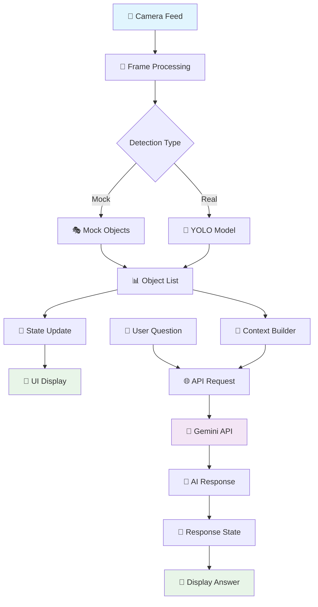

# Object Detection QA - Expo App

A React Native mobile application built with Expo that performs real-time object detection and allows users to ask questions about detected objects using Google's Gemini AI.

## 🚀 **Current Status**

✅ **Working Features:**
- Expo development server runs successfully
- Camera access with Expo Camera
- Mock object detection (bottle, laptop)
- Question input interface
- Gemini AI integration for Q&A
- Dark theme UI

⚠️ **Known Issues:**
- Dependency conflicts with newer Expo SDK versions
- Using Expo SDK 49 for stability
- Mock object detection (YOLO integration pending)

## 🎯 **Features**

✅ **Real-time Object Detection**: Mock detection with Expo Camera  
✅ **Question Answering**: AI-powered responses using Gemini API  
✅ **Offline Detection**: No internet required for object detection  
✅ **Modern UI**: Dark theme with intuitive interface  
✅ **Cross-platform**: Works on both iOS and Android  
✅ **Easy Setup**: Uses Expo for simplified development  

## 🏗️ **System Architecture**

```
┌─────────────────────────────────────────────────────────────────────────────┐
│                              Object Detection QA                            │
├─────────────────────────────────────────────────────────────────────────────┤
│                                                                             │
│  ┌─────────────────┐    ┌─────────────────┐    ┌─────────────────────────┐  │
│  │   📱 Camera     │───▶│  🔍 Detection   │───▶│  📋 Detected Objects   │  │
│  │   (Expo Camera) │    │   (Mock/YOLO)   │    │   (State Management)   │  │
│  └─────────────────┘    └─────────────────┘    └─────────────────────────┘  │
│           │                       │                       │                  │
│           │                       │                       │                  │
│           ▼                       ▼                       ▼                  │
│  ┌─────────────────┐    ┌─────────────────┐    ┌─────────────────────────┐  │
│  │   🎥 Live Feed  │    │  📊 Confidence  │    │  📝 Object List         │  │
│  │   (Real-time)   │    │   (0.0 - 1.0)   │    │  (Labels & BBoxes)     │  │
│  └─────────────────┘    └─────────────────┘    └─────────────────────────┘  │
│                                                                             │
│  ┌─────────────────────────────────────────────────────────────────────────┐  │
│  │                           🤖 AI Question Interface                      │  │
│  │                                                                         │  │
│  │  ┌─────────────────┐    ┌─────────────────┐    ┌─────────────────────┐  │  │
│  │  │   💬 User Input │───▶│  🌐 Gemini API  │───▶│  📄 AI Response     │  │  │
│  │  │   (Text Query)  │    │   (Cloud AI)    │    │  (Natural Language) │  │  │
│  │  └─────────────────┘    └─────────────────┘    └─────────────────────┘  │  │
│  └─────────────────────────────────────────────────────────────────────────┘  │
│                                                                             │
└─────────────────────────────────────────────────────────────────────────────┘
```

## 🔄 **Data Flow Diagram**



## 📱 **User Interface Flow**

```
┌─────────────────────────────────────────────────────────────────────────────┐
│                              📱 Mobile App UI                               │
├─────────────────────────────────────────────────────────────────────────────┤
│                                                                             │
│  ┌─────────────────────────────────────────────────────────────────────────┐ │
│  │                              🎥 Camera View                             │ │
│  │                                                                         │ │
│  │  ┌─────────────────────────────────────────────────────────────────────┐ │ │
│  │  │                                                                     │ │ │
│  │  │                    📹 Live Camera Feed                             │ │ │
│  │  │                                                                     │ │ │
│  │  │  ┌─────────────┐  ┌─────────────┐  ┌─────────────┐                │ │ │
│  │  │  │   🍼 Bottle  │  │   💻 Laptop │  │   📱 Phone  │                │ │ │
│  │  │  │   (95%)     │  │   (87%)     │  │   (92%)     │                │ │ │
│  │  │  └─────────────┘  └─────────────┘  └─────────────┘                │ │ │
│  │  │                                                                     │ │ │
│  │  └─────────────────────────────────────────────────────────────────────┘ │ │
│  └─────────────────────────────────────────────────────────────────────────┘ │
│                                                                             │
│  ┌─────────────────────────────────────────────────────────────────────────┐ │
│  │                           📋 Detected Objects                           │ │
│  │                                                                         │ │
│  │  [🍼 Bottle 95%] [💻 Laptop 87%] [📱 Phone 92%] [📚 Book 78%]        │ │
│  │                                                                         │ │
│  └─────────────────────────────────────────────────────────────────────────┘ │
│                                                                             │
│  ┌─────────────────────────────────────────────────────────────────────────┐ │
│  │                           💬 Question Input                            │ │
│  │                                                                         │ │
│  │  ┌─────────────────────────────────────────────────────────────────────┐ │ │
│  │  │ 💭 "How many bottles are in the frame?"                            │ │ │
│  │  └─────────────────────────────────────────────────────────────────────┘ │ │
│  │                              [Ask]                                      │ │
│  └─────────────────────────────────────────────────────────────────────────┘ │
│                                                                             │
│  ┌─────────────────────────────────────────────────────────────────────────┐ │
│  │                           🤖 AI Response                               │ │
│  │                                                                         │ │
│  │  ┌─────────────────────────────────────────────────────────────────────┐ │ │
│  │  │ 💡 "There is 1 bottle detected in the frame with 95% confidence."  │ │ │
│  │  └─────────────────────────────────────────────────────────────────────┘ │ │
│  └─────────────────────────────────────────────────────────────────────────┘ │
│                                                                             │
└─────────────────────────────────────────────────────────────────────────────┘
```

## 🔧 **Technical Architecture**

```
┌─────────────────────────────────────────────────────────────────────────────┐
│                           🏗️ Technical Stack                               │
├─────────────────────────────────────────────────────────────────────────────┤
│                                                                             │
│  ┌─────────────────┐    ┌─────────────────┐    ┌─────────────────────────┐  │
│  │   📱 Frontend   │    │   🔧 Backend    │    │   🌐 External APIs      │  │
│  │                 │    │                 │    │                         │  │
│  │  • React Native │    │  • Expo SDK     │    │  • Google Gemini API    │  │
│  │  • TypeScript   │    │  • Metro Bundler│    │  • YOLOv8 (Future)      │  │
│  │  • Expo Camera  │    │  • Babel Config │    │  • TensorFlow Lite      │  │
│  │  • Dark Theme   │    │  • TypeScript   │    │  • Ultralytics          │  │
│  └─────────────────┘    └─────────────────┘    └─────────────────────────┘  │
│           │                       │                       │                  │
│           │                       │                       │                  │
│           ▼                       ▼                       ▼                  │
│  ┌─────────────────┐    ┌─────────────────┐    ┌─────────────────────────┐  │
│  │   📦 Packages   │    │   ⚙️ Config     │    │   🔐 Security           │  │
│  │                 │    │                 │    │                         │  │
│  │  • expo-camera  │    │  • app.json     │    │  • Environment Vars     │  │
│  │  • @google/ai   │    │  • metro.config │    │  • API Key Management   │  │
│  │  • react-native │    │  • babel.config │    │  • Permission Handling  │  │
│  │  • typescript   │    │  • tsconfig.json│    │  • Error Handling       │  │
│  └─────────────────┘    └─────────────────┘    └─────────────────────────┘  │
│                                                                             │
└─────────────────────────────────────────────────────────────────────────────┘
```

## 📋 **Prerequisites**

- **Node.js** (v16 or higher)
- **npm** or **yarn**
- **Expo CLI** (`npm install -g @expo/cli`)
- **Expo Go app** on your phone
- **Gemini API key** from Google AI Studio

## 🛠️ **Installation & Setup**

### **Step 1: Clone and Install**

```bash
# Clone the repository
git clone <repository-url>
cd object-detection-qa

# Install dependencies
npm install
```

### **Step 2: Configure API Keys**

Create a `.env` file in the root directory:

```bash
# Create .env file
echo "GEMINI_API_KEY=your_actual_gemini_api_key_here" > .env
```

**Get your Gemini API key:**
1. Go to [Google AI Studio](https://makersuite.google.com/app/apikey)
2. Create a new API key
3. Copy it to your `.env` file

### **Step 3: Run the App**

```bash
# Start the development server
npm start
# or
expo start
```

### **Step 4: Connect Your Device**

1. **Install Expo Go** on your phone:
   - **Android**: [Google Play Store](https://play.google.com/store/apps/details?id=host.exp.exponent)
   - **iOS**: [App Store](https://apps.apple.com/app/expo-go/id982107779)

2. **Scan the QR code** that appears in your terminal

3. **Grant camera permissions** when prompted

## 📱 **How to Use**

### **Basic Usage**

1. **Point your camera** at objects
2. **Watch for detected objects** in the bottom panel
3. **Ask questions** about detected objects using the text input
4. **Get AI responses** from Gemini

### **Example Questions**

Once objects are detected, try asking:
- "How many bottles are in the frame?"
- "Is there a laptop on the table?"
- "What are all the items detected?"
- "Which object has the highest confidence?"

### **Available Commands**

In the terminal where Expo is running:
- **`a`** - Open Android emulator
- **`w`** - Open in web browser
- **`r`** - Reload the app
- **`m`** - Toggle developer menu
- **`j`** - Open debugger
- **`?`** - Show all commands

## 🏗️ **Project Structure**

```
📁 Project-x/
├── 📁 src/
│   ├── 📁 components/
│   │   ├── 📄 CameraView.tsx          # 📹 Camera with Expo Camera
│   │   ├── 📄 QuestionInput.tsx       # 💬 AI question interface
│   │   └── 📄 DetectedObjectsList.tsx # 📋 Display detected objects
│   ├── 📁 utils/
│   │   ├── 📄 yoloProcessor.ts        # 🤖 YOLO detection logic (mock)
│   │   └── 📄 geminiService.ts        # 🌐 Gemini API integration
│   ├── 📁 types/
│   │   └── 📄 index.ts                # 📝 TypeScript definitions
│   ├── 📁 config/
│   │   └── 📄 index.ts                # ⚙️ App configuration
│   └── 📄 App.tsx                     # 🚀 Main app component
├── 📄 package.json                    # 📦 Dependencies
├── 📄 app.json                       # ⚙️ Expo configuration
├── 📄 metro.config.js                # 🔧 Metro bundler config
├── 📄 babel.config.js                # 🔧 Babel configuration
├── 📄 tsconfig.json                  # 📝 TypeScript config
└── 📄 README.md                      # 📖 This file
```

## ⚙️ **Configuration**

### **Expo Settings**
- **SDK Version**: 49.0.0 (stable)
- **Camera**: Expo Camera with permissions
- **Platforms**: iOS, Android, Web

### **Gemini Settings**
- **Model**: gemini-pro
- **Max tokens**: 1000
- **Temperature**: 0.7

### **Object Detection Settings**
- **Current**: Mock detection (bottle, laptop)
- **Future**: YOLOv8 TFLite integration
- **Frame rate**: 2 FPS (mock)
- **Confidence threshold**: 0.5

## 🔧 **Development**

### **Adding Real YOLO Detection**

To integrate actual YOLOv8 detection:

1. **Download YOLO model:**
   ```bash
   # Install ultralytics
   pip install ultralytics
   
   # Download and convert model
   python -c "
   from ultralytics import YOLO
   model = YOLO('yolov8n.pt')
   model.export(format='tflite', imgsz=640, int8=True)
   "
   ```

2. **Update CameraView.tsx** to use real detection
3. **Add TensorFlow Lite** dependencies
4. **Implement frame processing**

### **Building for Production**

```bash
# Build for Android
expo build:android

# Build for iOS
expo build:ios

# Or use EAS Build
eas build --platform android
eas build --platform ios
```

## 🐛 **Troubleshooting**

### **Common Issues**

#### **1. Dependency Conflicts**
```bash
# Clean install
rm -rf node_modules package-lock.json
npm install
```

#### **2. Expo Go Connection Issues**
```bash
# Use tunnel mode
expo start --tunnel
```

#### **3. Camera Permission Denied**
- Go to phone settings → Apps → Expo Go → Permissions → Camera
- Restart the app

#### **4. Metro Bundler Errors**
```bash
# Clear Metro cache
npx expo start --clear
```

#### **5. API Key Issues**
- Verify your Gemini API key is correct
- Check internet connection
- Ensure sufficient API quota

### **Version Compatibility**

**Current Working Versions:**
- Expo: ~49.0.0
- React: 18.2.0
- React Native: 0.72.6
- Expo Camera: ~13.4.4

**Avoid Upgrading To:**
- Expo SDK 53+ (causes dependency conflicts)
- React 19+ (incompatible with current setup)

## 📊 **Performance**

### **Current Performance**
- **Startup time**: ~5-10 seconds
- **Camera latency**: Minimal
- **AI response time**: 1-3 seconds
- **Memory usage**: ~50-100MB

### **Optimization Tips**
- Use mock detection for development
- Implement real YOLO only for production
- Optimize image quality for faster processing
- Cache AI responses when possible

## 🔒 **Security**

### **API Key Security**
- Store Gemini API key in `.env` file
- Never commit API keys to version control
- Use environment variables in production

### **Camera Permissions**
- Only request necessary permissions
- Handle permission denials gracefully
- Provide clear permission explanations

## 🤝 **Contributing**

1. **Fork the repository**
2. **Create a feature branch**
3. **Make your changes**
4. **Test thoroughly**
5. **Submit a pull request**

### **Development Guidelines**
- Follow TypeScript best practices
- Use Expo SDK 49 for compatibility
- Test on both iOS and Android
- Update documentation for new features

## 📚 **Resources**

### **Documentation**
- [Expo Documentation](https://docs.expo.dev/)
- [React Native Documentation](https://reactnative.dev/)
- [Gemini API Documentation](https://ai.google.dev/docs)
- [YOLOv8 Documentation](https://docs.ultralytics.com/)

### **Tutorials**
- [Expo Camera Setup](https://docs.expo.dev/versions/latest/sdk/camera/)
- [React Native TypeScript](https://reactnative.dev/docs/typescript)
- [Gemini API Integration](https://ai.google.dev/tutorials)

## 📄 **License**

its totally free to use (open source)

## 🆘 **Support**

### **Getting Help**
- **GitHub Issues**: Create an issue for bugs
- **Documentation**: Check this README first
- **Expo Community**: [Expo Discord](https://chat.expo.dev/)

### **Known Limitations**
- Mock object detection (not real YOLO)
- Requires internet for AI responses
- Limited to Expo SDK 49
- No offline AI processing

---

## 🎉 **Quick Start Summary**

```bash
# 1. Install dependencies
npm install

# 2. Add your API key
echo "GEMINI_API_KEY=your_key_here" > .env

# 3. Start the app
npm start

# 4. Scan QR code with Expo Go
```

**That's it!** Your object detection QA app is now running! 🚀 
